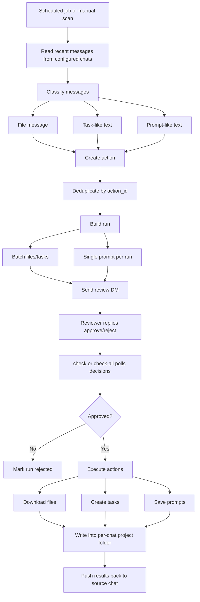
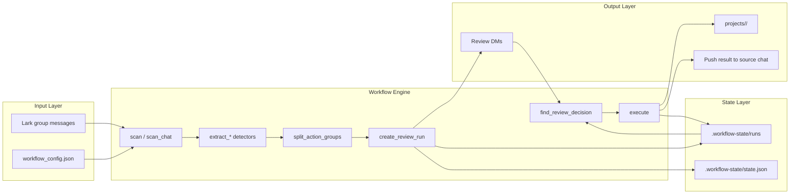

# Lark CLI Review Workflow

[中文说明](./README.md)

Human-in-the-loop automation for Feishu/Lark group chats, powered by `lark-cli`.

The workflow scans configured group chats, detects files, task-like messages, and prompt-like messages, sends each pending action to a reviewer, executes only after approval, and posts execution results back to the source group.

## Features

- Scan multiple Feishu/Lark group chats.
- Detect file messages and download approved files.
- Detect task-like messages and create approved Lark tasks.
- Detect prompt-like messages and save approved prompts one by one.
- Keep outputs separated by group in project folders.
- Send approval requests to a reviewer before any execution.
- Push execution results back to the original group.
- Run manually or on a schedule with launchd/cron.

## Design Overview

This project is intentionally built around controlled automation:

1. Group chats are the input layer, so messages are first classified.
2. Human review is the control gate before any real execution.
3. Execution is split by action type: file download, task creation, prompt capture.
4. Per-chat project folders act as the context layer for long-running usage.
5. Result pushback closes the loop and keeps the source group informed.

Prompt messages are always reviewed individually. One prompt creates one `run_id`, and approving that `run_id` executes only that prompt.

## Flow Diagram



## Architecture



## Requirements

- Python 3.9+
- [`lark-cli`](https://github.com/zhanglunet/lark-cli) available in `PATH`
- A Feishu/Lark CLI app configured with `lark-cli config init --new`

Common user scopes:

```bash
lark-cli auth login --scope "im:message.group_msg:get_as_user im:message.p2p_msg:get_as_user im:message:readonly im:resource task:task:write task:task:read contact:user.base:readonly offline_access"
```

Bot sending requires the app bot to have the relevant IM permissions and access to the reviewer/source chats.

## Configuration

Copy the example config:

```bash
cp workflow_config.example.json workflow_config.json
```

Edit `workflow_config.json`:

- `source_chats`: group chats to scan
- `source_chats[].chat_id`: chat ID such as `oc_xxx`
- `source_chats[].project_dir`: folder name under `execution.projects_dir`
- `reviewer_user_id`: reviewer open_id such as `ou_xxx`
- `scan.lookback_minutes`: scan lookback window
- `prompt_capture`: prompt detection rules
- `execution.projects_dir`: root folder for per-chat outputs
- `execution.task_assignee`: optional default assignee
- `execution.tasklist_id`: optional Lark tasklist

## Detection Rules

Files:

- Message type is `file`, with a file key in the message content

Tasks:

- `#task Follow up contract`
- `任务：准备会议纪要`
- `todo: Call customer`
- `- [ ] Prepare quote`

Prompts:

- Contains words such as `prompt`, `promt`, `提示词`, or `指令`
- Or phrases such as `请你`, `帮我`, or `结合这个文档`
- Meets `prompt_capture.min_chars`

## Usage

Create per-chat project folders:

```bash
python3 lark_workflow.py --config workflow_config.json init-projects
```

Scan chats and send review requests:

```bash
python3 lark_workflow.py --config workflow_config.json scan
```

Check approval replies and execute approved runs:

```bash
python3 lark_workflow.py --config workflow_config.json check-all
```

Check a specific run:

```bash
python3 lark_workflow.py --config workflow_config.json check <run_id>
```

Dry-run command preview:

```bash
python3 lark_workflow.py --config workflow_config.json --dry-run scan
```

## Project Folders

Outputs are stored by source chat:

```text
projects/
  example-chat/
    context.md
    files/
    prompts/
    results/
```

- `files/`: approved downloaded files
- `prompts/`: approved prompt text
- `results/`: execution records
- `context.md`: per-chat context notes

## Scheduling

Example launchd plist templates are in `examples/launchd/`.

Typical cadence:

- Scan every 5 minutes
- Check approvals every 1 minute

Cron equivalent:

```cron
*/5 * * * * cd /path/to/lark-cli-review-workflow && python3 lark_workflow.py --config workflow_config.json scan >> workflow.log 2>&1
* * * * * cd /path/to/lark-cli-review-workflow && python3 lark_workflow.py --config workflow_config.json check-all >> workflow.log 2>&1
```

## Local State

Ignored local files:

- `workflow_config.json`
- `.workflow-state/`
- `projects/`
- `*.log`
- `*.err`

Do not commit real chat IDs, open IDs, file keys, run state, downloaded files, or prompt contents.

## License

MIT
