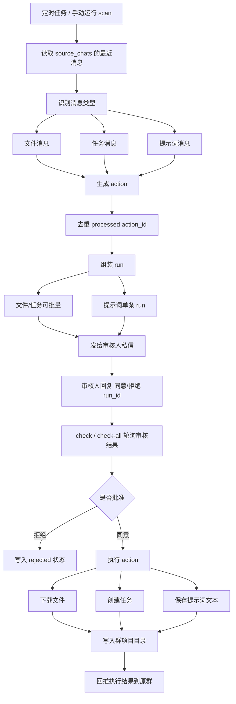
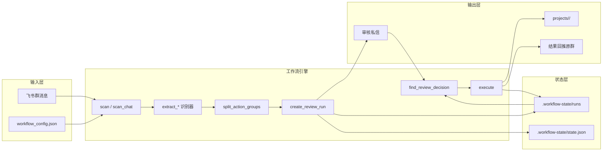

# 飞书群消息审核工作流

[English Version](./README.en.md)

基于 `lark-cli` 的飞书/Feishu 群消息人审工作流。

它会定时扫描指定群聊，识别文件消息、任务消息和提示词消息，先发送给审核人确认，再执行对应动作，并把执行结果推回原群。执行产物会按照群聊拆分到不同项目文件夹，方便长期管理上下文。

## 核心能力

- 扫描多个飞书群聊
- 识别文件消息并在审核通过后下载
- 识别任务型文本并在审核通过后创建飞书任务
- 识别提示词消息，并按单条审核、单条执行
- 按群聊建立独立项目目录，沉淀文件、提示词和执行结果
- 通过机器人私信发送审核请求
- 执行完成后把结果推回原群
- 支持手动运行，也支持 launchd/cron 定时运行

## 适用场景

- 把群里的文件、指令、任务需求纳入统一处理流
- 在真正执行前加入人工审核，避免误触发
- 为不同项目群保留独立上下文，不把文件和提示词混在一起
- 作为更复杂 Agent/Workflow 的基础调度层

## 设计思路

这个程序的设计重点不是“全自动”，而是“可控自动化”：

1. 群聊是输入层：消息天然杂乱，所以先做识别分类。
2. 审核是闸门层：任何执行动作都要先经过人工确认。
3. 执行是动作层：文件下载、任务创建、提示词保存分别走自己的处理逻辑。
4. 项目目录是上下文层：每个群一个目录，把历史输入和执行结果沉淀下来。
5. 原群回推是反馈层：让群内成员知道系统做了什么、是否成功。

这样的结构比“群里一句话直接执行”更稳，也更容易审计和扩展。

## 逻辑流程图



## 架构图



## 代码结构

主流程集中在 [lark_workflow.py](./lark_workflow.py)：

- `extract_file_action`：识别文件消息
- `extract_task_actions`：识别任务型文本
- `extract_prompt_action`：识别提示词消息
- `scan` / `scan_chat`：扫描群聊并生成待审核动作
- `split_action_groups`：把提示词拆成单条审核，把文件/任务保留为批量
- `create_review_run`：生成 run 并发送审核私信
- `find_review_decision`：从审核私信中判断同意或拒绝
- `execute`：执行已批准动作
- `project_root` / `ensure_project`：按群聊定位和初始化项目目录
- `send_result`：把执行结果回推原群

## 安装要求

- Python 3.9+
- `PATH` 中可直接调用 `lark-cli`
- 已用 `lark-cli config init --new` 配置好应用

常用用户权限：

```bash
lark-cli auth login --scope "im:message.group_msg:get_as_user im:message.p2p_msg:get_as_user im:message:readonly im:resource task:task:write task:task:read contact:user.base:readonly offline_access"
```

如果需要机器人发送审核消息和结果消息，应用机器人还需要具备对应 IM 权限，并能访问审核人与目标群。

## 配置说明

从模板生成配置：

```bash
cp workflow_config.example.json workflow_config.json
```

关键字段：

- `source_chats`：需要扫描的群聊列表
- `source_chats[].chat_id`：群聊 ID，格式如 `oc_xxx`
- `source_chats[].project_dir`：该群对应的项目目录名
- `reviewer_user_id`：审核人 open_id，格式如 `ou_xxx`
- `scan.lookback_minutes`：扫描回看时间窗口
- `prompt_capture`：提示词识别规则
- `prompt_capture.source_files`：提示词自动关联数据源文件的规则
- `prompt_execution.command`：真正执行 `prompt + 文件` 的本地命令模板，默认通过本地 `codex` 执行
- `execution.projects_dir`：所有项目目录的根路径
- `execution.task_assignee`：默认任务负责人，可为空
- `execution.tasklist_id`：默认任务清单，可为空

## 识别规则

文件消息：

- 消息类型是 `file`
- 内容中包含文件 key

任务消息：

- `#task Follow up contract`
- `任务：准备会议纪要`
- `todo: Call customer`
- `- [ ] Prepare quote`

提示词消息：

- 包含 `prompt`、`promt`、`提示词`、`指令`
- 或包含 `请你`、`帮我`、`结合这个文档`
- 同时满足 `prompt_capture.min_chars`

提示词永远是单条审核、单条执行。一条提示词对应一个 `run_id`。

提示词的数据源文件选择规则：

- 如果提示词是回复某个文件消息，优先把该文件作为数据源
- 再从提示词之前最近若干条消息里补充文件
- 数量由 `prompt_capture.source_files.max_files` 控制
- 如果提示词明确要求“分析群里所有文件”，则会改用 `prompt_capture.source_files.max_all_files`
- 回看范围由 `prompt_capture.source_files.lookback_messages` 控制

## 使用方式

初始化按群项目目录：

```bash
python3 lark_workflow.py --config workflow_config.json init-projects
```

扫描群聊并发送审核：

```bash
python3 lark_workflow.py --config workflow_config.json scan
```

检查审核回复并执行：

```bash
python3 lark_workflow.py --config workflow_config.json check-all
```

查看工作流监控状态：

```bash
python3 lark_workflow.py --config workflow_config.json monitor
```

只检查某个 `run_id`：

```bash
python3 lark_workflow.py --config workflow_config.json check <run_id>
```

预览将要调用的命令：

```bash
python3 lark_workflow.py --config workflow_config.json --dry-run scan
```

## 审核机制

审核人会收到这样的私信：

```text
工作流待审核：a1b2c3d4e5
来源群：Example Chat

1. 读取提示词：...

回复“同意 a1b2c3d4e5”后自动执行；回复“拒绝 a1b2c3d4e5”将取消。
```

批准：

```text
同意 a1b2c3d4e5
```

拒绝：

```text
拒绝 a1b2c3d4e5
```

`check-all` 每次最多执行一个刚刚被批准的待处理 run，这样节奏更可控。

执行结果默认回推到原群；如果机器人不在原群或回推失败，会自动私信审核人作为兜底通知。

如果某次提示词执行产出了本地结果文件，工作流会把结果摘要和结果文件一起回推到原群。
如果还没有配置 `prompt_execution.command`，工作流会把 prompt、关联的数据源文件和 `manifest.json` 打包成 zip，并明确标记为“未配置执行器”。

默认执行器是本地 `codex`：

- 工作流先把 prompt 和关联文件整理成 job 目录
- `prompt_job_executor.py` 会读取这些文件，拼装上下文，再调用 `codex exec`
- 普通分析类默认使用 `gpt-5.4`
- 设计类 / SVG 类任务默认切到更适合视觉创意约束的 `gpt-5.5`
- 普通分析类输出会落到 `jobs/<run_id>/outputs/result.md` 和 `result.json`
- 设计类 prompt 会优先产出 `jobs/<run_id>/outputs/result.svg`，并附一份简短的 `result.md`
- 工作流随后把结果摘要和产出文件发回原群

## 项目目录

每个群聊都有独立目录：

```text
projects/
  example-chat/
    context.md
    files/
    prompts/
    results/
```

- `files/`：审核通过后下载的文件
- `prompts/`：审核通过后保存的提示词文本
- `results/`：执行结果记录
- `context.md`：该群的上下文说明
- `jobs/`：每次 prompt 执行的作业目录，内含 `prompt.txt`、输入文件、输出文件和 `manifest.json`

如果某次执行产出了本地文件（例如提示词保存成 `txt`），工作流会在发送执行结果摘要后，继续把该文件作为附件回推到原群；如果原群发送失败，则自动私信审核人。

## 定时运行

`examples/launchd/` 中提供了 launchd 模板。

推荐频率：

- 每 5 分钟执行一次 `scan`
- 每 1 分钟执行一次 `check-all`

对应 cron：

```cron
*/5 * * * * cd /path/to/lark-cli-review-workflow && python3 lark_workflow.py --config workflow_config.json scan >> workflow.log 2>&1
* * * * * cd /path/to/lark-cli-review-workflow && python3 lark_workflow.py --config workflow_config.json check-all >> workflow.log 2>&1
```

## 本地状态与安全

以下内容默认不会进入 Git：

- `workflow_config.json`
- `.workflow-state/`
- `projects/`
- `*.log`
- `*.err`

不要提交真实的群聊 ID、open_id、文件 key、运行状态、下载文件或提示词内容。

## License

MIT
